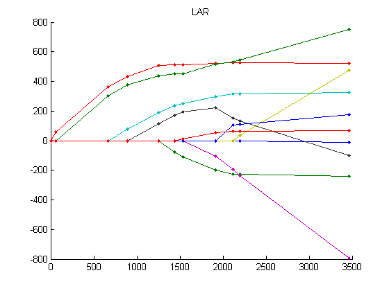
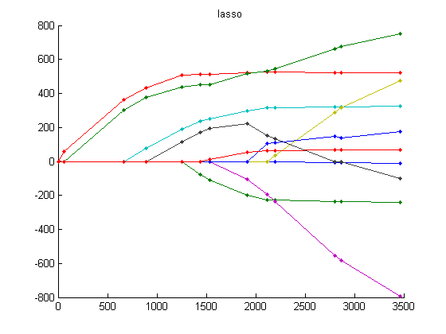

# LARS

Least Angle Regression (LARS) algorithm computes the whole optimal path for the LAR and Lasso in constrained form.

<strong>Input:</strong> a design matrix X, a response vector Y, option = lar or lasso, and an (optional) constraint parameter.

<strong>Output:</strong> the estimated coefficient vector and its support index, the estimated mean vector, and the current correlation and its maximal magnitude in the final step, and the history of step lengths during the LARS iterations. For details, see the function documentation.

<strong>Example:</strong>

LAR and Lasso whole paths for the diabetes data set used in [1].

|  | 
|:--:| 
| *LAR path* |

|  | 
|:--:| 
| *Lasso path* |

<strong>Remark:</strong>

There are two options using LARS function: one is standardized data (default) and the other is non-standardized. Standardized version of LARS centers Y and normalizes each columns of X to zero-mean and unit Euclidean length. To switch from standardized version to non-standardized one, simply setting the function parameter standardize = false.

<strong>References:</strong>

[1]  Efron et al. (2004) Least angle regression. Annals of Statistics, 32(2):407-499.
